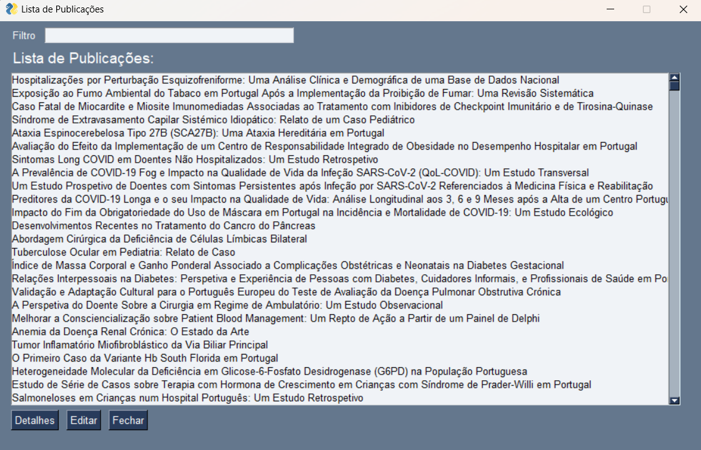

# Relatório final
# Projeto de ATP
Grupo 22: Joana Penela A103989, Miguel Sousa A103821, Pedro Sousa A102304
## Resumo
Este documento trata-se de um relatório de um projeto realizado pelos elementos referidos, proposto pelo professor José Carlos Ramalho e Luís Filipe Carvalho Cunha como objeto de avaliação para a disciplina Algoritmos e Técnicas de Programação do ano de 2024
O projeto trata-se do desenvolvimento de um sistema de gestão de publicações cientificas em Python, na qual permitirá aos utilizadores criar, atualizar, consultar, importar e exportar publicações cientificas.

## Introdução
Como objeto de avaliação da cadeira de algoritmos e técnicas de programação, foi proposta a criação de um sistema de gestão de publicações científicas em python na qual tivesse disponível todas as configurações básicas de uma aplicação de pesquisa de publicações. Na aplicação que criamos, intitulada de "Search Academy", disponibilizamos configurações tais como, inserção de publicações com nome do autor, titulo, resumo, palavras chaves, DOI, pdf url, data de criação e url do artigo, oportunidade do utilizador de importar e exportar artigos do seu ficheiro para outro ou vice versa através do titulo da publicação, oportunidade de consultar um artigo em especifico segundo qualquer filtro desejado, quer seja por titulo, autor, filiação, etc. Para além disso, no final da sua semana ou mês, terá acesso a um gráfico onde apresenta a sua evolução ao longo das mesmas.

### Estrutura da Base de dados
Para a realização da leitura em base de dados utilizamos dataframe e dicionarios. Assim, utilizamos a biblioteca de software PysimpleGUI e lista de dicionarios para adicionar novas tarefas à dataframe.

### Estrutura do trabalho
A aplicação criada é composta pelos botões: "Criar Publicação"que posteriormente terá disponível os botões "Adicionar autores" "Salvar" e "Cancelar"," Listar Publicações" que terá os botões "Detalhes", "Editar" e "Fechar", "Consulta", apresentando os botões referentes a todos os filtros possiveis de pesquisa, titulo, autor, aifiliação, data, palavra-chave e o botão "Voltar", "Remover Publicação", que apresenta um botão "Remover" e "Cancelar", "Estatistica de publicação" que terá botões para escolher se queremos uma analise por ano, mês, Top 20 autores e Top 20 palavras-chves, para além disso terá o botão "Gerar gráfico" e "Cancelar" e por fim o botão "Sair"  e por uma ListBox, onde surgem todos os dados a serem visualizados. De modo, a tornar a utilização da aplicação mais interativa e intuitiva recorremos a janelas pop-ups com mais opções de operações.

## Módulos importados e as suas funções
.json- Utilizado patra importar ficheiros em formato json. Tanto a dataset como os ficheiros criados para importar e exportar informação estão em formato json, sendo por isso necessário o import.json

.os- Fornece funcionalidades para interagir com o sistema operacional, como manipulação de caminhos de arquivos e locais.
No código, a função os.getcwd() é usada para obter o local atual de trabalho, e os.path.join() é usado para construir o caminho completo do ficheiro ata_medica_papers.json

matplotlib- Biblioteca utilizada para a criação da dos gráficos criados na função estatistica

PysimpleGUI- biblioteca escolhida para a criação da interface gráfica do trabalho

collections.counter- utilizado para contar as repetições de uma dada lista, util para a criação posterior das estatisticas

datetima- biblioteca para trabalhar com tempo e horas, util uma vez que trabalhamos com datas na nossa database

## Funcionalidades do código

Criar publicação:

Nesta função, o código irá aceder à dataset previamente definida como bd_artigos, criando entao um novo dicionario com os requisiitos também já definidos na dataset fornecida, questionando então cada um deles ao utilizador, para ser posteriormente adicionada uma nova publicação à dataset

Consultar publicações:

Mais uma vez o codigo irá aceder à bd_artigos e se a bd tiver algum artigo intitulado 'title' irá adicioná-lo a uma lista vazia, retornando então essa lista com todos os titulos existentes na dataset

Consultar uma publicação:

Nesta aplicação será possivel consultar uma publicação especifica através de vários filtros

    Consultar autor: Mais uma vez o codigo irá aceder à bd_artigos e se a bd tiver algum artigo com o autor explicitado pelo cliete irá adicioná-lo a uma lista vazia, retornando então essa lista com todos os titulos dos artigos na qual têm o autor explicitado na dataset.

    Consultar título: irá aceder à bd_artigos e se a bd tiver algum artigo com o titulo explicitado pelo cliete irá adicioná-lo a uma lista vazia, retornando então essa lista com o artigo com o titulo explicitado.

    Consultar afiliação: irá aceder à bd_artigos e se a bd tiver algum artigo com a afiliação explicitada pelo cliete irá adicioná-la a uma lista vazia, retornando então essa lista com o artigo com a afiliação explicitada.

    Consultar data: irá aceder à bd_artigos e se a bd tiver algum artigo com a data de criação explicitada pelo cliete irá adicioná-la a uma lista vazia, retornando então essa lista com os artigos com a data explicitada.

    Consultar palavra chave: irá aceder à bd_artigos e se a bd tiver algum artigo com a palavra-chave explicitada pelo cliete irá adicioná-la a uma lista vazia, retornando então essa lista com os artigos com a palavra-chave explicitado. 

Eliminar publicação: O funcionamento deste codigo recorre à criação de uma nova lista de dicionarios com todos os titutlos diferentes do titulo selecionado pelo utilizador, atualizando entao a bd_artigos com esse novo dicionario com a informação atualizada

Relatório de estatisticas:
    Estatistica da palavra chave: conta, recorrendo à criação de um dicionario, o número de vezes que uma palavra-chave é referida na bd_artigos;

    Eststistica do autor: conta, recorrendo à criação de um dicionario, o número de vezes que um autor é referido na bd_artigos;

    Estatistica do ano: conta, recorrendo à criação de um dicionario, a quantidade de artigos criados naquele ano.

Listar autores: Mais uma vez o codigo irá aceder à bd_artigos e se a bd tiver algum artigo intitulado 'author' irá adicioná-lo a um dicionario vazio, retornando então este dicionário com todos os autores existentes na dataset.

Importar dados: Tanto nesta função como na de exportar são utilizadas algumas funções auxiliares: carregadara() que carrega a data do nosso dataset; carrega_novadata() que irá carregar o ficheiro json na qual se quer importar a função; verificaestrutura() que verifica se a estrutura de dados a quererem ser importados do ficheiro json, estão na mesma estrutura que a bd_artigos, se nao for, retorna um aviso; unirdata() que junta a informação importada do novo json ao dataset original e por fim o atualizadata() para guardar as informações alteradas.

Exportar dados: Foram criadas dois tipos de exportação de dados: exportar uma dada publicação, que através da da função auxiliar pesquisadados() é possivel fazer uma lista com todos os artigos que se pretende exportar, para além disso ha a função exportardadosparciais, que exporta todos artigos do nosso ficheiro para o próximo.

Interface Gráfica: realizada com auxilio ao PysimpleGUI, tem as opções: Consultar autores, consultar publicações, criar publicações, listar publicações e estatistica. Dentro da estatistica temos estatistica de utilização de palavras-chaves, top 20 autores, publicações realizadas por ano e por mês, publicações de autor por ano e utilização de palavras-passe num ano.

Atualizar publicação: Quando selecionada a opção questiona inicialmente qual o DOI da publicação que se gostaria de atualizar, e posteriormente questiona que parte da publicação gostaria de atualizar, tendo disponivel qualquer filtro. Por fim recorre à função auxiliar atualizadata() para atualizar a dataset com a informação colocada.

Leave: Abandona a utilização da aplicação

## Menu terminal
O menu do terminal comece por nos apresentar a opção de Help que irá continuar com a utilização da aplicação, ou a opção Leave que abandona a aplicação:

Selecionando a opção Help o utilizador depara-se com o menu referido a baixo podendo selecionar qualquer opção, já referida a cima as funcionalidades:

## Interface
Quando selecionamos a opção 9 no terminal, obtemos a interface que aparece da forma representada a baixo, na qual tem várias opções disponiveis

Se selecionarmos o botão criar publicação aparece esta janela na qual nos pede toda a informação necessaria para criar a publicaçao e que será adicionada à dataset extamante da mesma forma que no terminal

Se selecionarmos a opção listar irão aparecer todos os titulos da spublicações presentes na dataset, dando nos a opção de poder ver os seus detalhes, como se pode ver pela segunda foto, ao selecionarmos um  titulo especifico e selecionarmos o botão detalhes

Para além disso, na opção listar, ainda temos a opção editar publicação, como se pode observar na imagem a baixo, podendo editar diretamente a publicação baseando-se na informação anterior

Ao selecionar a opção consultar, aparece-nos uma especie de menu onde podermos selecionar porque filtro é que gostariamos de consultar as nossas publicações, como esta referido em baixo

Em baixo encontra-se um exemplo caso o utilizador decidi-se selecionar a opção consultar por autores

Por fim se o utilizador selecionar a opção estatistica, terá uma panóplia de opções de escolha. 

O exemplo a baixo é o resultado que se obtém no monitor se se selecionar a estitistca dos top 20 autores

Em duas das opções, mais especificamente no Palavras-chave mais frequentes num ano, o utilizador tem a opção de selecionar o ano especifico. 

Para além disso, na opção Distruição de publicações de um autor por ano, o utilizador tem a oportunidade de escrever o nome do autor especifico que quer analisar.

## Conclusão

Na resolução deste trabalho expandimos consideravelmente o nosso conhecimento de algoritmos de programação, como também ajudou a consolidar o que aprendemos nas aulas.

Com este projeto tivemos a oportunidade de desenvolver o nosso conhecimento relativamente a interfaces gráficas (PySimpleGui), como também trabalhar um pouco com documentos json e criação de gráficos (matplotlib).

Este trabalho desenvolveu igualmente as nossas capacidades de trabalho em equipa, sendo tão necessário posteriormente na nossa vida como trabalhadores.

